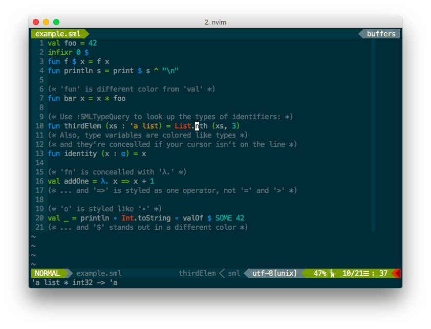

# vim-better-sml

> Some improvements to the default SML filetype plugins for Vim.


## Install

Install using your favorite plugin manager. For example, to install using
Vundle, add this line to your ~/.vimrc:

```
Plugin 'jez/vim-better-sml'
```

If you're unfamiliar using Vim plugins, check out [Vim as an IDE][vim-ide] which
will get you up to speed.

## Summary

[](https://raw.githubusercontent.com/jez/vim-better-sml/master/sample/example.png)

## Features

- Semantic Information
  - Look up type of identifier under cursor (`:SMLTypeQuery`)
  - Show type errors in sign column
- Syntax
  - Various corrections to default syntax highlighting
  - Conceal characters (`'a` to `α`, `fn` to `λ.`)
  - Highlighting for `*.sig`, `*.cm`, `*.mlb`, `*.lex`, `*.grm`, and
    `*.smackspec` files
- Indentation
  - Better `let ... in ... end` indentation
  - Better indentation with parentheses
- Filetype
  - Set up `'` and `$` as keyword characters
  - Set `'commentstring'` setting
- External plugins
  - delimitMate: set up quote characters
  - a.vim: set up `*.sig` and `*.sml` as alternates
  - Syntastic: detect and use CM files

## Usage

Most things work out of the box. **Some things require setup.**

Complete setup information is available in the help:

> [**`:help vim-better-sml`**](doc/vim-better-sml.txt).

Note: type introspection (`:SMLTypeQuery`) requires that MLton is installed.

## Configuration

A few settings are configurable. See `:help vim-better-sml-config`.

## Future Features

- [ ] Jump to definition
- [ ] Highlight all uses and definition
- [ ] Highlight unused definitions
  - Might want to do as a CLI tool
  - This way it could with with Syntastic to show markers in sign column
- [ ] Handle non-standard mlton name/location

## License

[](https://jez.io/MIT-LICENSE.txt)

<!-- References -->

[vim-ide]: https://github.com/jez/vim-as-an-ide
